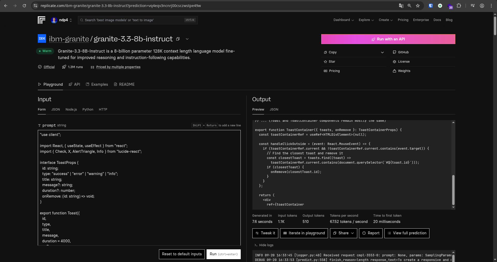
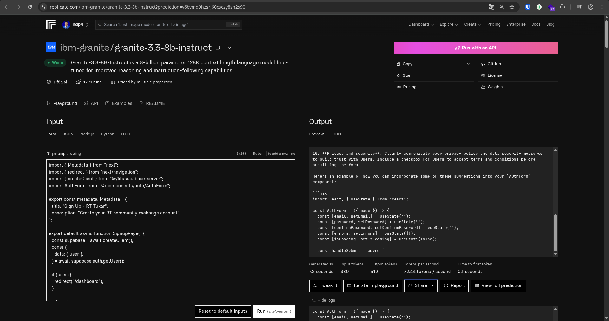

# 🏘️ RT Tukar - Community Exchange Platform

**RT Tukar** is a digital platform designed for RT (Rukun Tetangga/Neighborhood Unit) communities that enables residents to share unused items with their neighbors. This platform streamlines the exchange process between neighbors through an organized, user-friendly system equipped with real-time notifications and comprehensive dark/light theme support.

## 🤖 AI-Powered Development

This application was developed with significant assistance from **IBM Granite AI Model**, which provided intelligent code generation, debugging support, and architectural guidance throughout the development process. We extend our sincere gratitude to the Granite AI model for its invaluable contributions to building this community-focused platform.

### Development Process with Granite AI

The development leveraged Granite AI's capabilities for:

- **Code Architecture**: Intelligent system design and component structuring
- **Problem Solving**: Advanced debugging and error resolution
- **Feature Implementation**: Smart code generation for complex features
- **Best Practices**: Guidance on modern web development standards
- **Documentation**: Comprehensive technical documentation generation


_Screenshot showing Granite AI assistance in the development process_


_Example of Granite AI providing intelligent code suggestions and solutions_

## ✨ Features

### 🔐 Authentication & Authorization

- **Secure Login/Register**: Email-based authentication powered by Supabase
- **RT Management**: Each user is registered to a single RT community
- **Role-based Access**: Distinct access levels for administrators and members
- **Session Management**: Persistent login with automatic token refresh

### 📦 Item Management

- **Add Items**: Upload photos and descriptions of items to share
- **Browse Items**: View all available items in the RT with an organized grid layout
- **Item Details**: Comprehensive information including photos, descriptions, and owner details
- **CRUD Operations**: Full Create, Read, Update, Delete functionality for item management
- **Like System**: Users can like/unlike items with real-time counters
- **Comments**: Interactive comment system for each item
- **Real-time Updates**: Instant data synchronization across all clients

### 🤝 Request System

- **Request Items**: Submit requests for desired items
- **Approve/Reject**: Item owners can accept or decline requests
- **Request History**: Complete tracking of request status (pending, approved, rejected)
- **Bidirectional Tracking**: Both donors and requesters can monitor status
- **Request Notes**: Additional messaging for requests

### 📱 QR Code Integration

- **Generate QR**: Each approved item receives a unique QR code
- **Scan to Verify**: Pickup validation through integrated QR scanner
- **Pickup Confirmation**: Digital confirmation that items have been collected
- **QR Code Expiry**: Automatic QR code expiration after pickup completion

### 🔔 Notification System

- **Real-time Notifications**: Instant notifications for all platform activities
- **Notification Bell**: Interactive bell icon with unread notification counter
- **Notification Dropdown**: Comprehensive interface for notification management
- **Multiple Notification Types**:
  - Like notifications (when items are liked)
  - Comment notifications (when new comments are added)
  - Request notifications (when item requests are submitted)
  - Request status updates (approve/reject notifications)
  - Pickup confirmations
- **Mark as Read**: System for marking notifications as read
- **Auto-cleanup**: Automatic removal of old notifications
- **Auto-cleanup**: Notifikasi lama otomatis terhapus


### 🎨 Dark/Light Mode Support

- **System Theme Detection**: Automatic synchronization with system preferences
- **Manual Theme Toggle**: Switch between Light, Dark, and System modes
- **Persistent Settings**: Theme preferences stored in localStorage
- **Smooth Transitions**: Elegant animations during theme switches
- **Comprehensive Coverage**: All components support dark mode
- **CSS Custom Properties**: Consistent theming system
- **Responsive Theme**: Theme adaptation across all screen sizes

### 👥 Admin Dashboard

- **User Management**: Comprehensive RT member management
- **Item Oversight**: Monitor all platform items
- **Request Monitoring**: Overview of requests and their status
- **Analytics**: Platform usage statistics
- **Member Statistics**: User count and activity data

### 🛡️ Security Features

- **Row Level Security (RLS)**: Policies ensuring users only access their RT's data
- **Secure File Upload**: Protected storage with access policies
- **Role-based Permissions**: Granular admin/member access control
- **HTTPS Enforcement**: Secure connections for production deployment
- **Data Validation**: Comprehensive input sanitization and type checking

## 🛠️ Tech Stack

### Frontend

- **Next.js 14** - Modern React framework with App Router
- **TypeScript** - Type-safe development environment
- **Tailwind CSS** - Utility-first CSS framework with dark mode support
- **Lucide React** - Icon library
- **Lucide React** - Professional icon library
- **CSS Custom Properties** - Dynamic theming system
- **LocalStorage API** - Persistent theme preferences

### Backend & Database

- **Supabase** - Comprehensive Backend-as-a-Service
  - PostgreSQL database with advanced querying capabilities
  - Real-time subscriptions for instant notifications
  - Authentication with secure session management
  - Storage solutions for photos with access policies
  - Row Level Security (RLS) for robust data protection
  - Database functions for complex business operations

### Additional Libraries

- **html5-qrcode** - Advanced QR code scanning with camera integration
- **qrcode** - QR code generation with customization options
- **React Hooks** - Custom hooks for efficient state management
- **Event Listeners** - Real-time UI updates and interactions

### UI/UX Enhancements

- **Theme System**: Centralized theme management architecture
- **Responsive Design**: Mobile-first responsive layout approach
- **Accessibility**: ARIA labels and comprehensive keyboard navigation
- **Loading States**: Skeleton loading animations and progress indicators
- **Error Handling**: Comprehensive error boundaries and user feedback
- **Toast Notifications**: Elegant in-app feedback system

## 📋 Prerequisites

- **Node.js 18+** (Latest LTS version recommended)
- **npm or yarn** package manager
- **Supabase account** (free tier sufficient for development)
- **Modern browser** with camera support (for QR scanner functionality)
- **HTTPS connection** for production (required for camera access)

## 🚀 Quick Start

### 1. Clone and Install

```bash
git clone https://github.com/NDP4/rt-tukar-community-platform.git
cd rt-tukar-community-platform
npm install
```

### 2. Environment Setup

Copy `.env.example` to `.env.local` and configure with your Supabase credentials:

````bash
```bash
cp .env.example .env.local
````

Configure `.env.local`:

```env
NEXT_PUBLIC_SUPABASE_URL=your_supabase_project_url
NEXT_PUBLIC_SUPABASE_ANON_KEY=your_supabase_anon_key
SUPABASE_SERVICE_ROLE_KEY=your_service_role_key_for_admin_functions
```

### 3. Database Setup

The database setup has been prepared with complete SQL exports from Supabase. All necessary schema files are located in `/sql/` directory:

#### Available Database Files:

- **`supabase_full_schema.sql`** - Complete database schema export with all tables, policies, and functions
- **`schema_with_rls.sql`** - Schema with Row Level Security policies configured
- **`schema.sql`** - Basic schema structure
- **`public_schema.sql`** - Public schema definitions
- **`supabase-seed.sql`** - Sample data for testing (optional)

#### Setup Instructions:

**Option 1: Complete Setup (Recommended)**

1. Access your Supabase dashboard
2. Open the SQL Editor
3. Copy and execute the contents of `sql/supabase_full_schema.sql`
4. This will create all tables, RLS policies, functions, and storage buckets

**Option 2: Step-by-step Setup**

1. Start with `sql/schema.sql` for basic structure
2. Apply `sql/schema_with_rls.sql` for security policies
3. Optionally run `sql/supabase-seed.sql` for sample data

**Option 3: Development/Testing Setup**

1. Use `sql/supabase_full_schema.sql` for complete setup
2. For notification system testing, optionally run:
   ```sql
   -- Temporarily disable RLS for testing (optional)
   ALTER TABLE likes DISABLE ROW LEVEL SECURITY;
   ALTER TABLE profiles DISABLE ROW LEVEL SECURITY;
   ALTER TABLE notifications DISABLE ROW LEVEL SECURITY;
   ```

#### Database Features Included:

- **Complete table structure** for users, RT communities, items, requests, notifications
- **Row Level Security (RLS) policies** for data isolation between RT communities
- **Real-time subscriptions** configuration for notifications
- **Storage buckets** and policies for item photos
- **Database functions** for complex operations
- **Indexes** optimized for performance
- **Sample data** (optional) for testing features

#### Important Notes:

- The `supabase_full_schema.sql` includes all production-ready configurations
- RLS policies ensure users only see data from their RT community
- Storage policies are configured for secure file uploads
- All database exports are kept up-to-date with the latest features

### 4. Storage Configuration

1. In Supabase dashboard, navigate to Storage
2. Ensure the 'items' bucket is created
3. Configure bucket policy for public read access
4. Verify storage permissions for authenticated users

### 5. Run the Application

```bash
npm run dev
```

Open [http://localhost:3000](http://localhost:3000) in your browser.

## 📖 Usage Guide

### For New Users

1. **Sign Up**: Create an account using email/password
2. **Join RT**: Select an existing RT or create a new one (automatically becomes admin)
3. **Complete Profile**: Fill in profile information and upload photo
4. **Theme Setup**: Choose preferred theme (Light/Dark/System)

### For Members

1. **Browse Items**: Explore available items within the RT community
2. **Like & Comment**: Interact with items through likes and comments
3. **Request Items**: Click "Request" on desired items
4. **Track Requests**: Monitor request status on "My Requests" page
5. **QR Pickup**: When approved, show QR code to donor for pickup verification
6. **Notifications**: Receive real-time notifications for all activities

### For RT Admins

1. **Manage Members**: Administer RT members and their permissions
2. **Oversee Items**: Monitor all items within the RT community
3. **Handle Requests**: Assist with approve/reject decisions when needed
4. **Scan QR Codes**: Validate pickup codes on behalf of members
5. **View Analytics**: Access community activity statistics
6. **System Management**: Configure RT settings and community policies

## 🗂 Project Structure

```
/app                          # Next.js App Router pages
  /auth                       # Authentication pages (login/signup)
    /login                    # Login form with dark mode support
    /signup                   # Signup form with validation
  /dashboard                  # Main dashboard with notifications
  /requests                   # User requests management
  /my-requests                # Personal request tracking
  /items                      # Items browsing and management
  /scanner                    # QR code scanner interface
  /admin                      # Admin dashboard and management
  /theme-test                 # Theme testing page

/components                   # Reusable UI components
  /auth                       # Authentication components
    AuthForm.tsx              # Login/signup form with dark mode
  /dashboard                  # Dashboard components
    Dashboard.tsx             # Main dashboard layout
    DashboardClient.tsx       # Client-side dashboard logic
  /items                      # Item-related components
    ItemCard.tsx              # Individual item card with like/comment
    ItemGrid.tsx              # Grid layout for items
    AddItemModal.tsx          # Modal for adding new items
    EditItemModal.tsx         # Modal for editing items
    CommentsModal.tsx         # Modal for comments
    RequestModal.tsx          # Modal for item requests
  /layout                     # Layout components
    Navbar.tsx                # Navigation with notifications & theme toggle
  /ui                         # UI utility components
    NotificationBell.tsx      # Notification bell icon with counter
    NotificationDropdown.tsx  # Dropdown for notification management
    NotificationItem.tsx      # Individual notification display
    ThemeToggle.tsx           # Theme switcher (Light/Dark/System)
    Toast.tsx                 # Toast notification system
    AlertModal.tsx            # Alert modal component
  /admin                      # Admin-specific components
    AdminDashboard.tsx        # Admin overview
    ItemsManagement.tsx       # Admin items management
    MembersList.tsx           # RT members management
  /requests                   # Request-related components
    RequestsList.tsx          # List of all requests
    DonorRequests.tsx         # Request management for donors

/lib                          # Utility libraries
  supabase.ts                 # Supabase client configuration
  supabase-server.ts          # Server-side Supabase client
  utils.ts                    # Utility functions & notification system
  theme.ts                    # Theme utilities & CSS custom properties
  types.ts                    # TypeScript type definitions
  database.types.ts           # Generated Supabase types

/hooks                        # Custom React hooks
  useAuth.ts                  # Authentication hook

/sql                          # Database schemas and exports
  supabase_full_schema.sql    # Complete database export with all features
  schema_with_rls.sql         # Schema with Row Level Security policies
  schema.sql                  # Basic database structure
  public_schema.sql           # Public schema definitions
  supabase-seed.sql           # Sample data for testing (optional)

/public                       # Static assets
  *.svg                       # Icon files
  image.png                   # Granite AI development process screenshot
  image1.png                  # Granite AI code generation screenshot
```

## 🧪 Testing Features

### Test Case 1: Complete Request Flow

```

1. User A posts an item (status: available)
2. User B requests the item
3. User A accepts request → generates QR code

## 🧪 Testing Features

### Test Notification System

1. **Like Notifications**: Like an item and check notification bell
2. **Comment Notifications**: Comment on item, owner receives notification
3. **Request Notifications**: Request item, owner receives immediate notification
4. **Status Notifications**: Approve/reject request, requester receives update
5. **Real-time Updates**: Open multiple tabs and test real-time notifications

### Test Theme System

1. **Manual Toggle**: Use theme toggle in navbar
2. **System Detection**: Change system theme and check auto-sync
3. **Persistence**: Refresh browser and check theme persistence
4. **Component Coverage**: Test all pages for dark mode consistency

### Test QR Code System

1. **Generate QR**: Request item and approve to receive QR code
2. **Valid Scan**: Scan valid QR code for pickup confirmation
3. **Invalid Scan**: Test scanning invalid/expired QR codes
4. **Mobile Camera**: Test QR scanner on mobile devices

### Test Case Scenarios

#### Test Case 1: Complete Request Flow with Notifications

```

1. User A posts item → notification system ready
2. User B likes item → User A gets like notification
3. User B comments → User A gets comment notification
4. User B requests item → User A gets request notification
5. User A approves → User B gets approval notification + QR code
6. User A scans QR code → pickup confirmed → both get confirmation notifications

```

#### Test Case 2: Theme Switching

```

1. Start with system theme (auto-detect)
2. Switch to light mode → verify all components
3. Switch to dark mode → verify consistent theming
4. Refresh browser → verify persistence
5. Change system preference → verify auto-sync when on system mode

```

#### Test Case 3: RT Data Isolation

```

1. User in RT A cannot see items from RT B
2. Notifications only for same RT activities
3. RLS policies enforce complete data isolation
4. Admin only sees their RT's data

````

## 🔧 Development

### Adding New Components

To add new components with dark mode support:

```tsx
import { cn } from "@/lib/theme";

export function NewComponent() {
  return (
    <div
      className={cn(
        "bg-white dark:bg-gray-900",
        "text-gray-900 dark:text-white"
      )}
    >
      {/* Your component content */}
    </div>
  );
}
````

### Adding New Notification Types

1. Update notification types in `lib/types.ts`:

```typescript
export type NotificationType =
  | "like"
  | "comment"
  | "request"
  | "request_approved"
  | "request_rejected"
  | "pickup_confirmed"
  | "new_type";
```

2. Add notification function in `lib/utils.ts`:

```typescript
export async function notifyNewType(
  userId: string,
  message: string,
  relatedId?: string
) {
  return createNotification(userId, "new_type", message, relatedId);
}
```

3. Update notification display in `NotificationItem.tsx` to handle new type

### Database Migrations

If you need to modify database schema:

1. Update `supabase-schema.sql`
2. Apply changes in Supabase SQL Editor
3. Update TypeScript types in `lib/database.types.ts`
4. Test notification system after schema changes

### Adding New Features

1. Create components in appropriate `/components` subdirectory
2. Add pages in `/app` directory using App Router conventions
3. Update types in `/lib/types.ts`
4. Add utility functions in `/lib/utils.ts`
5. Implement dark mode classes using theme utilities
6. Add notifications if feature requires user interaction

## 📦 Deployment

### Vercel (Recommended)

1. Connect GitHub repository to Vercel
2. Add environment variables in Vercel dashboard:
   ```
   NEXT_PUBLIC_SUPABASE_URL=your_supabase_project_url
   NEXT_PUBLIC_SUPABASE_ANON_KEY=your_supabase_anon_key
   SUPABASE_SERVICE_ROLE_KEY=your_service_role_key
   ```
3. Configure build settings:
   - Framework: Next.js
   - Build Command: `npm run build`
   - Output Directory: `.next`
4. Deploy automatically on push to main branch

### Other Hosting Platforms

Ensure your hosting platform supports:

- Node.js 18+ with App Router support
- Environment variables configuration
- Static file serving for images
- HTTPS (required for camera access)
- WebSocket connections for real-time features

### Production Considerations

1. **Database Optimization**:

   - Enable RLS policies for production
   - Configure proper indexes for performance
   - Set up regular backups

2. **Storage Configuration**:

   - Configure CDN for faster image loading
   - Set proper file size limits
   - Implement image optimization

3. **Security**:
   - Never expose service role key in client code
   - Configure CORS policies
   - Enable HTTPS redirects
   - Set up rate limiting

## 🚨 Important Notes

### Security Considerations

- **Never expose `SUPABASE_SERVICE_ROLE_KEY`** in client-side code
- **RLS policies** enforced at database level for data protection
- **File uploads** restricted to authenticated users only
- **QR codes** are single-use and expire after collection
- **Theme preferences** stored locally, do not expose sensitive data
- **Notifications** only for same RT members

### Performance Considerations

- **Real-time subscriptions** optimized for specific RT only
- **Image uploads** compressed automatically
- **Notification queries** indexed for fast retrieval
- **Theme switching** uses CSS custom properties for smooth transitions
- **Component lazy loading** for faster initial page load

### Limitations

- One RT per user (by design for community focus)
- Photo storage limited by Supabase plan (upgrade if needed)
- QR scanner requires HTTPS in production (browser security requirement)
- Notification real-time updates require stable internet connection
- Dark mode requires modern browser support for CSS custom properties

### Browser Support

- **Modern browsers** with ES6+ support
- **Camera access** for QR scanning (requires HTTPS)
- **LocalStorage** for theme persistence
- **WebSocket** for real-time notifications
- **CSS Custom Properties** for dynamic theming

## 🤝 Contributing

1. Fork the repository
2. Create feature branch: `git checkout -b feature/new-feature`
3. Implement feature with proper dark mode support
4. Add tests for new functionality
5. Test notification system if feature affects user interactions
6. Update documentation in README.md
7. Test thoroughly in light and dark modes
8. Submit pull request with detailed description

### Coding Standards

- Use TypeScript for type safety
- Follow Tailwind CSS patterns with dark mode classes
- Implement proper error handling
- Add notifications for user interactions
- Use semantic HTML with proper ARIA labels
- Follow React best practices with hooks
- Maintain consistent component structure

## 📄 License

This project is developed for educational purposes. Feel free to modify for your specific use case or community needs.

## 🆘 Troubleshooting

### Common Issues

**"Cannot connect to Supabase"**

- Check environment variables in `.env.local`
- Ensure Supabase project is active and accessible
- Verify network connection and firewall settings

**"RLS policy error"**

- Verify user is member of an RT
- Check if policies are properly applied di Supabase
- For testing, temporarily disable RLS: `ALTER TABLE table_name DISABLE ROW LEVEL SECURITY;`

**"QR scanner not working"**

- Ensure HTTPS di production (browser requirement)
- Check camera permissions di browser settings
- Verify html5-qrcode library properly loaded
- Test di different browsers atau devices

**"Photo upload fails"**

- Check Supabase storage policies dan permissions
- Ensure bucket 'items' exists dan properly configured
- Verify file size within limits
- Check network connectivity untuk upload

**"Notifications not appearing"**

- Check real-time subscription connection
- Verify notification functions di utils.ts
- Check browser console untuk WebSocket errors
- Ensure RLS policies allow notification access

**"Dark mode not working"**

- Check browser support untuk CSS custom properties
- Verify theme toggle component di navbar
- Check localStorage untuk theme persistence
- Clear browser cache dan reload

**"Theme not persisting"**

- Check localStorage permissions di browser
- Verify ThemeToggle component implementation
- Check for JavaScript errors in console
- Test in incognito mode for clean state

### Performance Issues

**"Application loading slowly"**

- Check network connection and Supabase region
- Optimize images or reduce file sizes
- Check browser dev tools for performance bottlenecks
- Consider implementing component lazy loading

**"Real-time updates delayed"**

- Check WebSocket connection stability
- Verify Supabase real-time subscription settings
- Test with different network conditions
- Check for multiple subscription conflicts

### Getting Help

1. Check browser console for detailed error messages
2. Verify Supabase dashboard for database logs and data
3. Ensure all dependencies are properly installed: `npm install`
4. Check file permissions and paths
5. Test in different browsers or devices
6. Check network connectivity and firewall settings
7. Verify environment variables configuration
8. Test with fresh database setup if persistent issues occur

### Debug Tools

- Use `/debug` page for testing authentication
- Use `/theme-test` page for testing theme switching
- Use browser dev tools for network and performance analysis
- Check Supabase dashboard for real-time logs
- Use console.log for debugging notification flow

## 🙏 Acknowledgments

### IBM Granite AI Model

We extend our deepest gratitude to the **IBM Granite AI Model** for its exceptional assistance throughout the development of this platform. The AI's intelligent contributions were instrumental in:

- **Code Architecture Design**: Providing sophisticated system design patterns and component structuring
- **Advanced Problem Solving**: Offering intelligent debugging solutions and error resolution strategies
- **Feature Implementation**: Generating efficient, production-ready code for complex functionalities
- **Best Practices Guidance**: Ensuring adherence to modern web development standards and security practices
- **Documentation Excellence**: Creating comprehensive technical documentation and user guides

The development process was significantly enhanced by Granite AI's ability to understand complex requirements, suggest optimal solutions, and provide contextual coding assistance. This project stands as a testament to the powerful collaboration between human creativity and AI intelligence.

### Development Journey with AI

The screenshots below demonstrate the collaborative development process with Granite AI:


_Granite AI providing intelligent code suggestions and architectural guidance_


_AI-assisted debugging and feature implementation process_

## 📄 License

This project is developed for educational and community purposes. Feel free to modify and adapt it for your specific community needs or learning objectives.

---

## 🏆 Project Highlights

**Built for RT communities in Indonesia 🇮🇩**

_Empowering neighbors to share and care for each other through innovative technology solutions._

### Latest Features

- 🔔 **Complete Notification System** with real-time updates and comprehensive notification types
- 🎨 **Dark/Light Mode Support** with system detection and smooth transitions
- 🚀 **Enhanced UI/UX** with modern design patterns and intuitive interactions
- 📱 **Mobile-Optimized** responsive design for all device types
- 🛡️ **Improved Security** with properly configured RLS policies and data protection
- 🤖 **AI-Powered Development** leveraging IBM Granite AI for intelligent code generation

### Community Impact

This platform aims to strengthen neighborhood bonds by facilitating resource sharing, reducing waste, and promoting sustainable community practices. Through technology, we enable meaningful connections between neighbors while fostering a culture of mutual support and environmental responsibility.

---

_Developed with ❤️ for Indonesian communities, powered by IBM Granite AI_
